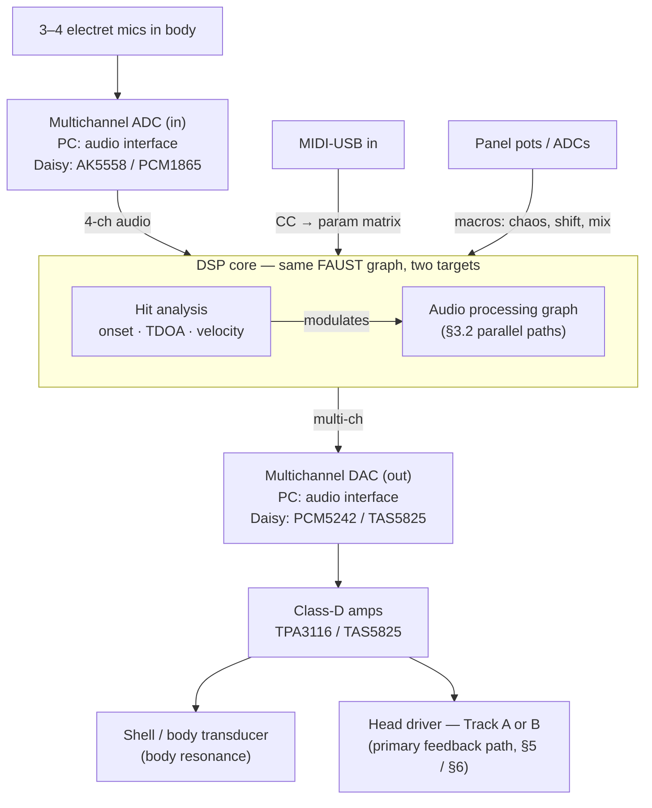

# Digital Djembe / Hybrid Acoustic-Electric Darbuka — Design Plan

A living design document. Captures the discussion so far; each section is
intended to be edited as the build progresses.

## 1. Goal

Build a hybrid acoustic-electric hand drum (originally a djembe, now a
**darbuka** — see §4) that sounds like an acoustic drum when played, but with
controllable electronic augmentation: feedback, resonances, inharmonic
overtones, and DSP-shaped sustain. The target sound is *controllable musical
chaos*, **not** a drone.

Previous attempt: a speaker mounted inside the body under the head produced a
single-pitch Larsen feedback that was unpleasant and uninteresting. Avoiding
that failure mode is a central design constraint.

### Design thesis
Pure acoustic feedback through one transducer converges to whichever mode has
highest loop gain → one pitch, locked. Musical chaos requires **phase
incoherence** (so no single mode dominates) and **multiple parallel paths**
(so the system can't settle into a fixed point). Every DSP choice below
serves this thesis.

## 2. Compute platforms — prototype on PC, deploy to Daisy

Two targets, **same FAUST DSP graph**. FAUST compiles `djembe.dsp` to
either a PC JACK client (`faust2jack`) or bare-metal Daisy firmware
(`faust2daisy`) from identical source — the graph is portable, so
nothing we commit to in the prototype phase locks us out of the
deployment phase.

### 2.1 Prototyping platform — PC + multichannel USB audio interface

**Primary development platform.** A Linux PC with an 8 in / 8 out USB
audio interface (one is on hand) is the first target, not second.
Rationale:

- **Channel count matches Track B first prototype exactly:** 4 channels
  for the mic array (§3.1) + 8 channels for the 2×4 segmented coil
  drive (§6.3.4) fit in a single 8-in / 8-out interface with room to
  spare on the input side.
- **Iteration speed:** edit `djembe.dsp` → `faust2jack` → restart
  client → test. Loop closes in seconds. No flashing, no bootloader,
  no serial console.
- **Tooling:** Python measurement (`measure.py`), spectral analysis,
  record-everything-simultaneously, and FAUST's web/IDE previews all
  run natively on the dev machine.
- **Same analog chain as the final instrument.** The external class-D
  amps planned for deployment (TPA3116 / TAS5825) drop in between the
  interface outputs and the transducers today, validating the amp
  stage end-to-end before Daisy ever enters the picture.
- **De-risks the hard parts first.** Whether the DSP sounds right,
  whether planar coils drive the head, whether feedback is
  controllable — all answerable on PC. Daisy then becomes a packaging
  step, not a discovery step.

**Latency.** JACK or PipeWire-JACK at 48 kHz / 64-sample buffer
delivers ~3–6 ms total round-trip on a decent USB interface, vs.
~1 ms on bare-metal Daisy. For the closed feedback loop this shifts
which modes lock preferentially (phase accumulates faster at high
frequencies) but does not kill the effect — the §3.2 path-2
freq-shifter breaks the phase coherence either way. An incidental
benefit: prototyping at higher latency teaches us how sensitive the
design actually is to latency, which is useful knowledge for free.

**Stability.** RT-priority for the JACK/PW audio thread (`chrt
--fifo 80` or equivalent, or a pre-configured audio Linux) keeps
xruns out under load.

### 2.2 Deployment target — Daisy Seed

**Chosen for the finished instrument:** STM32H7 @ 480 MHz, 64 MB SDRAM,
onboard audio codec, ~$30, first-class FAUST backend.

Considered and rejected:
- ESP32 — too weak for multi-channel DSP at low latency.
- Raspberry Pi Zero 2W — viable with PREEMPT_RT but more OS overhead
  and unfortunate form-factor / boot-time tradeoffs for a standalone
  instrument.
- OWL pedal — similar capability, more expensive, larger.

Known limitations that only bite at deployment:
- Onboard codec is stereo in/out only. A 3–4 element mic array needs
  an **external multichannel I2S/TDM ADC** (AK5558 eval or PCM1865
  pair). The planar magnetic drive (§6) likewise needs multichannel
  output for segmented coil drive — another external I2S DAC.
- These are avoidable during prototyping because the PC interface
  covers all required channels natively.

Control: **MIDI over USB** (Daisy has USB host/device). OSC over WiFi
deferred unless needed.

### 2.3 Porting path

The Daisy port is the *last* step, not the first:

1. PC prototype validates the full DSP graph against real mic array,
   real transducers, real coils, real amps.
2. Once the instrument sounds right on PC, port `djembe.dsp` to Daisy
   via `faust2daisy`. DSP logic is unchanged; target-specific code is
   only the audio I/O glue.
3. Wire Daisy-side multichannel ADC + DAC for the same channel count
   the PC interface provided.
4. Build enclosure, panel pots, OLED / encoder UI.

If the PC prototype reveals Daisy's compute or I/O is insufficient
(unlikely at the current scope), reconsider platform before building
the enclosure — not before.

## 3. High-level architecture

### 3.1 Sensing — one mic array, three jobs
- **Audio pickup** → summed input to DSP graph.
- **Onset + velocity** → envelope follower triggers modal bank, resets LFOs.
- **Hit localization** → TDOA (time-difference-of-arrival) cross-correlation
  across mic pairs gives (x, y) of each strike. Maps to parameter
  modulation: e.g., edge hits raise drive/chaos, center hits favor sustain.

Chosen over piezos, optical, or head-mounted sensors because it adds **zero
mass** to the head and provides all three jobs from the same hardware.

### 3.2 DSP graph — parallel paths, not one loop

1. **Dry path.** Summed mic array → HPF → light compression → output mix.
2. **Frequency-shifted feedback.** Single-sideband shift of 3–20 Hz in the
   loop. Key trick: small shift breaks phase-coherent Larsen pileup, so
   feedback drifts chaotically in pitch instead of locking.
3. **Modal resonator bank.** 6–12 tuned biquads/waveguides pumped by the
   input envelope. Simulates head modes (fundamental + first few circular
   modes); gives "feedback-like" sustain *without* needing acoustic
   round-trip. Designer controls which modes ring.
4. **Self-oscillating SVF bank.** 2–4 state-variable filters with Q past
   oscillation threshold; input perturbs them. Inharmonic sine pads that
   modulate chaotically from strikes.
5. **Nonlinear waveshaper.** Soft saturation before the output sum —
   generates harmonics from whatever fundamentals come in.

Mixing: (2)–(5) route predominantly to the **head driver** (strong head
coupling, where real acoustic feedback can occur, now broken up by path 2's
freq shift so it can't lock). (1) and body-resonance-friendly content route
to the **shell/body transducer**. With a segmented planar magnetic drive
(§6), each DSP path can additionally route to a *specific coil segment* to
excite a specific mode.

### 3.3 Control surface
- MIDI-USB: CCs through a routing matrix to feedback gain, shift amount,
  modal mix, chaos/drive, waveshaper amount, **and per-segment gain/phase
  for the planar coil (§6)**.
- Pots on Daisy's ADCs: 4–6 most-used macros for standalone play.
- Hit (x, y, velocity) is itself a modulation source — treat as a 3D
  controller.

### 3.4 Physical model as a first-class component

Before any hardware exists and long after it does, we need to drive
virtual strikes at arbitrary (x, y) positions through the DSP graph. A
**circular-membrane modal model** fills that role as a named component in
`djembe.dsp` and plugs into the existing architecture without rewriting
anything downstream.

#### 3.4.1 Physical basis — the ideal clamped circular membrane

The model is the textbook 2D wave equation on a disk with a fixed
(clamped) rim. What's in `djembe.dsp` is **modal synthesis with
ideal-membrane coefficients**: we borrow the classical eigenfrequencies
and eigenshapes from the PDE, but the actual ringing is a bank of
resonant biquads, not a PDE solver.

**The PDE:**

    ∂²u/∂t² = c² ∇²u,     u(R, φ, t) = 0,     c = √(T/σ)

where u(r, φ, t) is transverse displacement, T is head tension (N/m),
σ is areal mass density (kg/m²), R is the head radius. The boundary
condition u(R, φ, t) = 0 is the darbuka's metal hoop pinning the skin
to zero displacement at the rim.

**Separation of variables on the disk** (u = F(r)·G(φ)·e^{iωt}) gives

    ψ_{m,n}(r, φ) = J_m(j_{m,n} · r / R) · cos(m·φ)
    ω_{m,n}       = (c / R) · j_{m,n}

where J_m is the m-th Bessel function of the first kind and j_{m,n} is
its n-th positive zero. The clamped-rim condition is exactly what
forces J_m to vanish at r = R, which is why the mode's radial argument
is scaled by j_{m,n}. The index m counts **nodal diameters**; n counts
**nodal circles** (the rim counts as one). Each m ≥ 1 mode also has a
sin(m·φ) partner at the same frequency — a degenerate pair that real
drums split slightly when tension is uneven; we collapse to the cos
branch for the sketch.

**Strike excitation.** A localized impulse at (r₀, φ₀) with velocity v
projects onto each mode via the spatial-overlap integral of the forcing
against the mode shape, which for a point strike collapses to the mode
shape evaluated at the strike point:

    a_{m,n} ∝ ψ_{m,n}(r₀, φ₀) · v
           = J_m(j_{m,n} · r₀ / R) · cos(m·φ₀) · v

That's the `w_{m,n}` weight used in `djembe.dsp`. Intuitively: a mode
rings louder the more the strike lands on one of its anti-nodes, and
falls silent if the strike lands on one of its nodes (the sign flips
of J_m or the zeros of cos m·φ).

#### 3.4.2 Mode table and FAUST weights

The first nine (m, n) modes match the frequency ratios already in
`djembe.dsp`:

| (m, n) | ratio f/f_{0,1} = j_{m,n}/j_{0,1} | j_{m,n} |
|--------|-----------------------------------|---------|
| (0, 1) | 1.000 | 2.4048 |
| (1, 1) | 1.593 | 3.8317 |
| (2, 1) | 2.135 | 5.1356 |
| (0, 2) | 2.295 | 5.5201 |
| (3, 1) | 2.653 | 6.3802 |
| (1, 2) | 2.917 | 7.0156 |
| (4, 1) | 3.156 | 7.5883 |
| (2, 2) | 3.500 | 8.4172 |
| (0, 3) | 3.598 | 8.6537 |

Each mode becomes a resonant biquad at f_0 · ratio, excited by
`strike × w_{m,n}` instead of the current uniform 1/9. The old uniform
`head(x)` is the degenerate center-strike case (J_m(0) = 0 for m > 0,
J_0(0) = 1 — only m=0 "breathing" modes fire, which is correct for a
true center strike but wrong for everything else).

Pickup is modeled as a uniform average over the head. A per-mode readout
weight ψ_{m,n}(r_mic, φ_mic) applied on the output side would make mic
position audible in the simulation, but it's deferred until there's a
reason to care.

#### 3.4.3 What the ideal model omits

The PDE above is the simplest thing that gives Bessel modes. The real
head violates every one of its assumptions at some level:

- **Air load.** A real head moves air; the air's inertia lowers every
  mode frequency by several percent, and non-uniformly — lower modes
  more than higher ones. This is why a real drum's overtones aren't
  exactly at the Bessel ratios.
- **Shell coupling.** Energy leaks through the rim into the goblet
  body's acoustic modes and back. Q is set by this loss, not by the
  membrane. The `qHead` slider is a single global approximation;
  reality is per-mode.
- **Bending stiffness.** Real skin / Mylar has non-zero flexural
  rigidity, so it's technically a plate, not a pure membrane. Dispersion
  pushes high-n modes sharp relative to the Bessel prediction.
- **Tension inhomogeneity.** Tuning isn't perfectly uniform around the
  hoop, so the m ≥ 1 cos/sin degenerate pair splits into two slightly
  different frequencies. This split is literally what produces the
  characteristic "beat" in a real drum and is completely absent from
  this model.
- **Nonlinearity at hard strikes.** Large-amplitude displacement stiffens
  the membrane (Berger / von Kármán regime); pitch rises briefly on
  loud hits and settles back as amplitude decays.
- **Per-mode damping.** Each (m, n) has its own Q in reality, mostly
  set by where that mode loses energy (rim, air, internal).
- **Pickup location.** Current code sums modes with uniform weight on
  output — equivalent to a pickup that weights every mode equally. A
  real mic at (r_mic, φ_mic) would apply ψ_{m,n}(r_mic, φ_mic) a
  second time on the readout side. **Confirmed audibly on 2026-04-19:**
  strikes at X = +0.7 and X = −0.7 (Y = 0) sound different — +0.7 is
  brighter — even though the two points are related by a 180° rotation
  of the drum and should be indistinguishable on a rotationally
  symmetric membrane. Why our model breaks symmetry here: the round-trip
  output ∝ Σ ψ_{m,n}(strike) · ψ_{m,n}(mic) · h_{m,n}(t) picks up
  (-1)^{2m} = +1 for every mode under rotation **only when the pickup
  also applies a mode-shape weight**. Our uniform output factor is a
  missing ψ_mic; odd-m modes keep a rotation-induced sign flip that
  would be canceled by a proper readout weight, and that sign flip
  changes the initial transient envelope, which reads as a timbre
  change. Adding a per-mode readout weight is cheap and is now a
  Track 0 step (§9) rather than deferred.

None of these are fatal for the role the model plays in §3.4.4:
qualitative prototyping of the DSP graph, test-vector generation, and
coil-pattern decomposition. They become significant once we're trying
to match a specific real head's spectrum — which is what the
calibration step (§3.4.5) is for.

#### 3.4.4 Three roles this component plays

1. **Pre-hardware prototyping.** Drive the existing DSP graph from
   modeled strikes instead of the mic array. Freq-shifted feedback
   (§3.2 path 2), modal bank (path 3), self-osc SVFs (path 4), and
   waveshaper (path 5) all run unchanged. Tunes the whole chain against
   virtual strikes at canonical positions (center / halfway / edge /
   off-axis) before the darbuka is ever instrumented.

2. **Post-hardware test vectors.** With known (x, y, v) going in, the
   model predicts which modes should ring and how loudly. Cross-check
   against (a) what the TDOA localizer reports and (b) the measured
   mic-array signal. Mismatches diagnose whether the fault is mic
   placement, TDOA math, or head physics assumptions.

3. **Forward/inverse pair for §6.3 coil segmentation.** The same
   Bessel decomposition that maps (strike position) → (mode weights)
   also maps (target mode weights) → (per-segment coil drive). An
   azimuthally segmented coil with N wedges is a spatial Fourier basis
   on φ; radial segmentation samples J_m at specific radii. To pump
   mode (m, n), integrate ψ_{m,n} over each wedge/ring to get that
   segment's relative amplitude and phase. The physical model is
   what lets us design and debug drive patterns offline, instead of
   discovering on the bench that our "pump m=2" pattern also pumps
   m=0 because we got the Bessel integrals wrong.

#### 3.4.5 Calibration against a real head

Given the omissions in §3.4.3, real mode frequencies and Qs drift a few
percent (or more) from theory. Calibration plan:

- Mechanical striker (solenoid + arm on a stand) fixed at known (r, φ),
  sweeping a grid of positions on the real head.
- `measure.py` captures per-position IRs.
- Fit per-mode f and Q to measurement; **keep the shape weights
  w_{m,n} from theory** unless measurement shows the shape predictions
  themselves are badly off.

Frequency-only calibration probably suffices; shape-function calibration
would require a mic-scan across the head (far more effort) and is
deferred until there's evidence it's needed. Modeling the cos/sin
degenerate split and per-mode Q are the most likely first extensions
if frequency-only fitting leaves the simulation sounding clearly unlike
the real drum.

#### 3.4.6 Implementation

Lives in `djembe.dsp` as a new `strikeModel(x, y, v)` component that
replaces the uniform-weight head excitation. Bessel evaluation uses
libm's `j0f`/`j1f`/`jnf` through FAUST `ffunction` — available on both
the Linux development toolchain (glibc) and the Daisy target (newlib),
no custom approximations needed. Weights are cached between strikes,
so no audio-rate Bessel calls.

## 4. Pivot: djembe → darbuka

Switched because a **darbuka has a removable metal hoop** tensioning the
head, whereas a djembe uses rope. The metal hoop is:
- Rigid and in direct intimate contact with the skin at its boundary.
- Bolt-able without destroying the instrument.
- A better mechanical transmission path than any wood route.

This makes the single highest-risk item — mechanically coupling a transducer
to the head without damping it — much more tractable.

## 5. Transducer track A: tactile / off-the-shelf (baseline)

### 5.1 Physics
A clamped membrane has zero displacement at its boundary. But if you *move
the boundary itself* (shake the hoop), every mode with radial slope at the
edge — all of them — gets excited in proportion to hoop velocity. Rimshots
work for this reason on a snare.

### 5.2 Mount options

**Currently testing (tactile, off-the-shelf):**
- **A. Hoop clamp** — C-shaped clamp that straddles the darbuka's tuning
  hoop between two bolts. Non-destructive. Likely best coupling.
- **B. Tuning-bolt-replacement bracket** — L-bracket captured under an
  existing tuning bolt. Uses stock hardware; no drilling, no clamp force
  loss.
- **C. Body-interior (magnetic for metal bodies)** — magnet-mounted
  tactile transducer on the inside wall of the goblet. Baseline for
  comparison; excites body modes, couples to head only via air + edge.

**Previously tried by the user, rejected (prior art):**
- **Speaker mounted inside the body under the head.** Produced a
  single-pitch Larsen lock, unpleasant and static. Fails for a
  structural reason: one transducer + flat-gain feedback converges to
  whichever mode has highest loop gain and stays there. This failure
  motivated the whole §1 design thesis (phase incoherence + multiple
  parallel paths). Do not revisit without the DSP countermeasures in
  §3.2.
- **Piezo discs bonded directly to the head.** *Did* drive the head,
  which validated direct head-drive as a concept — but frequency
  response was poor. Three compounding reasons:
  - Piezos have an intrinsic mechanical resonance in the ~3–8 kHz
    range that peaks hard and colors everything it drives.
  - Piezo motion is strain-based (µm-scale), roughly frequency-flat in
    *voltage drive*, which means vanishing *displacement* at low
    frequencies — so bass response is weak.
  - Piezos are capacitive (nF load), mismatched to standard
    voltage-source amps at low frequency; most of the voltage swing
    never becomes strain.
  - Also concentrates mass-loading at a single bond point, damping
    the local area.

  Takeaway: direct head drive works, but a piezo is the wrong actuator
  class for a flat-response audio-band driver.

**Formerly rejected, now revived:**
- **D. Direct head driver.** Originally rejected for mass-loading /
  damping the head. Revived in a low-mass flex-PCB form as the planar
  magnetic track (§6), which also sidesteps the piezo frequency-response
  problem by using Lorentz force (F = BIL) that's flat with frequency
  and voltage-matched to conventional amps.

### 5.3 Measurement protocol
Before committing to any permanent build:
1. Use `measure.py` (Farina log sine sweep → IR deconvolution → magnitude
   transfer function).
2. Measurement mic: 5 cm above head center, held by the `mic_jig` printed
   cap so runs are reproducible across mounts.
3. Run the sweep with each mount (A/B/C). Save labeled results.
4. `measure.py --compare A B C` overlays the transfer functions.
5. Decision criteria:
   - Most energy into head-mode peaks (80–400 Hz range for a 220 mm head).
   - Flattest/broadest response (more modes available for DSP to pump).
   - Whether any mount gets loud enough to cause acoustic feedback at
     modest drive — the actual go/no-go for the feedback DSP concept.

### 5.4 Hardware (this repo)
- `measure.py` — measurement script (log sweep, deconvolution, plotting).
- `brackets.scad` — parametric OpenSCAD for the four printed parts:
  `hoop_clamp`, `bolt_bracket`, `body_magnet`, `mic_jig`.

### 5.5 Role of this track
Serves as the **baseline / known-works reference**. Cheap, off-the-shelf,
and ready to measure now. Protects against the failure mode where a fabbed
flex PCB underperforms and we can't tell whether the fault is in the coil,
the magnets, the DSP, or the conceptual approach.

## 6. Transducer track B: planar magnetic drive (flex-PCB coil on the head)

A more ambitious transducer track. Rather than mount a moving-mass tactile
transducer to the body or hoop, bond a **thin flex PCB spiral coil** to the
outer annulus of the drum head and mount an **alternating-polarity magnet
array** inside the shell directly below it. The head itself becomes the
diaphragm of a **planar magnetic driver** — same operating principle as a
HiFiMan/Audeze headphone or a Magnepan speaker, applied to the darbuka head.

### 6.1 Why this is compelling
- **Very low added mass** (~1–2 g for flex PCB + laquer) → negligible
  damping of the head's natural acoustic character. This was the blocker
  that killed option D earlier; the flex PCB form factor removes it.
- **Distributed force** over the coil area rather than point coupling.
- **Modal-selective drive** via coil segmentation — a capability no tactile
  transducer can offer (see §6.3).

### 6.2 Key design constraint: B-field geometry

A flat spiral coil in a uniform *axial* B-field produces **zero net axial
force** — the Lorentz force is radial, not up/down. To drive the head
perpendicular to itself, the field at the coil plane must be **radial**
(in-plane). Three magnet topologies achieve this:

- **Planar-magnetic-headphone style (chosen).** Parallel magnet bars with
  alternating N-S-N-S polarity on a plate inside the shell, a few mm below
  the head. Serpentine coil traces run *between* adjacent bars; each trace
  sees an opposite field from its neighbor, and if the coil's current also
  alternates between traces, all Lorentz forces add coherently.
- **Radially-magnetized ring magnet.** Specialty hardware, expensive, hard
  to source.
- **Push-pull disc magnets above and below the head.** Efficient, but puts
  hardware above the playing surface — defeats the whole point.

The magnet plate lives inside the darbuka body, invisible to the player,
non-contact with the head. 2–4 mm clearance to the head is enough.

### 6.3 Coil segmentation → modal selectivity

This is the capability the tactile path cannot replicate and the main
reason to pursue this track. **Three orthogonal axes of segmentation are
available**, and combining them is where the interesting behavior lives:

1. **Azimuthal** — how many wedges around the ring (§6.3.1).
2. **Radial** — how many concentric coil rings at different radii
   (§6.3.2).
3. **Drive pattern** — the phase/amplitude the DSP sends to each
   segment in real time (§6.3.3).

#### 6.3.1 Azimuthal segmentation (wedges around the ring)

A uniform *axisymmetric* spiral coil applies uniform force around the
annulus. Under this excitation, only **m=0 modes** (the "breathing" /
concentric-ring modes) respond. Non-axisymmetric modes (m=1, m=2, m=3)
have a cos(mφ) azimuthal dependence; their response to uniform annular
force integrates to zero — they are **unreachable** by an axisymmetric
coil. m≥1 modes are what give a drum its expressive tom/djun character,
so reaching them matters.

Split the coil into N wedge segments driven from separate DSP channels.
Azimuthal count N sets which m-modes are reachable:

| N | Modes reachable | Amp channels | Notes |
|---|-----------------|--------------|-------|
| 2 | m=0, m=1 | 2 | Minimal; can't do rotating patterns |
| 4 | m=0..m=2 | 4 | Sweet spot for a first build |
| 8 | m=0..m=3 | 8 | Reaches higher modes; amp cost jumps |
| 16 | m=0..m=7 | 16 | Diminishing returns; most drum-interesting modes are m≤3 |

#### 6.3.2 Radial segmentation (concentric coil rings)

Orthogonal to azimuthal segmentation and arguably more powerful. **Radial
modes** (n=1, 2, 3 — the nodal *circles* of a Bessel-function drum head)
differ in whether their displacement sign flips at certain radii. A coil
at one radius excites a given radial mode with one sign; a coil at a
different radius excites the same mode with the opposite sign.

Proposed: two concentric coil rings on the same flex PCB:
- **Outer ring** at r ≈ 0.85 R (near the edge — low displacement for
  fundamental, high for higher radial modes).
- **Inner ring** at r ≈ 0.55 R (moderate displacement for fundamental,
  opposite sign for n=2 overtone).

Driving the two rings **in phase** pumps the fundamental (n=1);
**anti-phase** pumps the first radial overtone (n=2). Combined with
azimuthal wedging, this gives independent control of both (m, n) mode
indices. It's cheap — one extra coil ring on the same PCB, same
fabrication run. It doubles the coil count (hence amp channel count) for
a given N.

#### 6.3.3 Drive patterns — the real-time control surface

Given a geometric segmentation, what the DSP *sends* to each segment is
the per-strike instrument voice. Patterns worth implementing as firmware
primitives:

**Azimuthal patterns** (over N=4 wedges within one ring):
| Pattern | Effect |
|---------|--------|
| All in phase, equal amplitude | m=0 breathing — centered thump sustain |
| Dipole (+, +, -, -) | m=1 sloshing / tom-like wobble |
| Quadrupole (+, -, +, -) | m=2 tighter inharmonic ring |
| Quadrature-phased around ring | Rotating mode — spinning/phasing timbre with no acoustic analog |
| Random phase, slow-LFO modulated | Chaotic modal pump — directly serves the §1 thesis |
| Follow hit-location (x, y) from TDOA | Auto-route feedback into the azimuthal sector the player struck |

The last one is instrument-defining: the drum **remembers where you hit
it** and routes sustain/feedback into the matching angular sector. No
other drum can do that.

**Radial patterns** (inner ring vs outer ring):
| Inner : Outer phase | Effect |
|---------------------|--------|
| In phase | Pumps fundamental (n=1) |
| Anti-phase | Pumps first radial overtone (n=2) |
| Inner only | Centered / bass-weighted drive |
| Outer only | Edge / treble-weighted drive |

#### 6.3.4 First-prototype target: 2 rings × 4 wedges = 8 coils

Combines both segmentation axes on a single PCB revision:
- 2 concentric coil rings (radial dimension): ~0.55 R inner, ~0.85 R
  outer.
- Each ring split into 4 azimuthal wedges.
- **8 total coils, 8 amp channels**, reached with two 4-channel class-D
  boards.
- Modal reach: m=0..m=2 azimuthally × n=1..n=2 radially.

This is the densest first revision that still fits comfortably on a
single flex PCB and is drivable by two commodity class-D boards. Any less
and we leave significant instrument-defining capability on the table; any
more and the amp stage scales up without proportional musical return.

#### 6.3.5 Musical moves unlocked by the combined segmentation

- Strike center (m=0 energy) but have the feedback loop drive m=1,
  producing a wobble/roll rather than a pitch.
- Hit at the edge (high radial overtone energy) but DSP pumps the
  fundamental back — the drum resonates with a tone the player didn't
  produce.
- Rotating mode patterns (quadrature phasing between segments) for
  spatialized/phasing timbres.
- Mode-swapping sustain: decay the struck mode while gradually pumping
  a different (m, n) pair, morphing the drum's ring from one pitch/shape
  to another during the tail.

### 6.4 Power, efficiency, and thermal budget

The question the design stands or falls on: can a thin-copper PCB coil
deliver enough mechanical force into the head to sustain feedback and
pump modes audibly? Rough estimates below say **yes, with margin, for
the sustain-feedback use case** — but not for driving the drum loud
from silence.

#### 6.4.1 How much mechanical power does the head need?

For a darbuka head's fundamental mode (~150 Hz, ~15 g modal mass,
damping Q ≈ 20–30):

- **Stored modal energy for audible ring** (~0.1 mm peak displacement):
  E ≈ ½ · m · (2πf·x)² ≈ ½ · 0.015 · (0.094)² ≈ 75 µJ.
- **Energy loss per oscillation period:** ΔE = (2π/Q) · E ≈ 16 µJ at
  Q=30.
- **Power to sustain against damping:** P_mech ≈ ΔE · f ≈
  16 µJ · 150 Hz ≈ **2–5 mW mechanical**.

This is tiny. Sustaining existing oscillation (which is all feedback
needs to do) is a low bar. Generating that amplitude from silence is a
much higher bar (joules-scale transient), but we don't need to — the
player's strike seeds the oscillation and the DSP loop sustains or
amplifies it.

#### 6.4.2 Electromechanical efficiency

For a planar magnetic coil in a well-designed alternating-polarity
magnet array:

- Gap field at 2–3 mm clearance from N42 bar magnets: **B ≈ 0.3–0.5 T**
  (measured at the coil plane, not at the magnet face).
- Total conductor length *in the useful field region* per coil segment
  (half of each turn runs under a bar): L ≈ 6 m for a 50-turn, 80 mm
  mean-diameter coil.
- **Force factor BL ≈ 2–3 N/A.** For reference, a typical voice-coil
  speaker has BL of 5–15 N/A; planar magnetic headphones are ~2–4.
- To deliver 1 N peak force → I_peak ≈ 0.4 A, I_rms ≈ 0.3 A.
- Overall electrical-to-mechanical efficiency for this geometry: **~1–5%**
  (typical for planar magnetic drivers).

At 5% efficiency, 5 mW mechanical requires **~100 mW electrical per
coil** — easily within the per-trace current rating.

#### 6.4.3 Impedance target

Flex PCB coils are resistive. Rough numbers for a single-layer 1 oz
copper, 0.2 mm traces, 50 turns at ~80 mm mean diameter:
**~60–100 Ω per segment**. Far from the 4–8 Ω a standard class-D amp
expects.

Levers to pull:
- **2 oz copper** (R halves).
- **4-layer flex with the four copies wired in parallel** (~4× R drop).
- **Wider traces** (0.3–0.5 mm), trading turn count for resistance.

Target: **8–16 Ω per segment**, well inside the TPA3116's 4–8 Ω
specification with a series resistor or slight amp detuning.

#### 6.4.4 Thermal limits of the flex PCB

The real ceiling is not amp power — it's trace heating. For a 2 oz
copper trace 0.3 mm wide, 6 m long, resistance ~5 Ω:

- At I_rms = 0.3 A (our sustain-feedback operating point):
  **P_diss ≈ 450 mW per coil**. Polyimide dissipates this easily; a
  handful of °C rise.
- At I_rms = 1.0 A (pushed hard): **P_diss ≈ 5 W per coil**. Traces
  approach ~60–80 °C; nearing substrate softening. Brief peaks OK,
  sustained NOT OK.
- All 8 coils running at 0.5 A = 3.6 W total across the array —
  comfortable.

Verdict: the coil comfortably handles the 100–500 mW per segment we
actually need. Its upper limit (~2–3 W per coil continuous) is a
hard ceiling for short transient peaks, not a normal operating point.

#### 6.4.5 Verdict — can a planar coil cut it?

**Yes, for the intended use case:** sustaining and shaping feedback
that the player's strike has already seeded. The required mechanical
power (~5 mW per active mode) is ~2 orders of magnitude below what
the PCB coil can safely deliver.

**Caveats and monitoring points:**
- Planar coils will *not* drive the drum loudly from silence — don't
  expect the instrument to function as a speaker without player input.
  For generating audible tones independent of strikes, the modal
  resonator bank (§3.2 path 3) does that in DSP, not via the coil.
- BL depends strongly on magnet gap. Going from 2 mm to 5 mm clearance
  roughly halves BL, quadrupling the current needed for the same force.
  Magnet plate mounting precision matters.
- The tactile path (§5) gives us a **force-vs-frequency reference**
  before the PCB arrives. If the DAEX13 at ~1 W produces acoustic
  feedback at modest drive, the planar coil's ~0.5 W per segment × 8
  segments = 4 W total will very likely exceed that threshold.
- If the first PCB revision falls short, the levers are (in order):
  more copper (add layers or go 2 oz → 3 oz at higher cost), stronger
  magnets (N52 vs N42), smaller gap, more turns per segment.

### 6.5 Fabrication path
- **PCB**: JLCPCB or PCBWay flex PCB service. 4-layer, 2 oz outer copper,
  polyimide substrate. First prototype follows §6.3.4: **2 concentric
  rings (inner ~0.55 R, outer ~0.85 R) × 4 azimuthal wedges = 8 coils**.
  For a 220 mm head, that's roughly a 200 mm OD annular flex PCB with an
  inner cutout to avoid the center (which isn't driven anyway). Cost
  ~$10/board at MOQ 5, lead time ~1–2 weeks.
- **Adhesion**: thin-film contact adhesive (3M 467MP) or clear urethane
  laquer. Needs an acoustic test to confirm it doesn't stiffen the head
  perceptibly — test on a spare head before committing.
- **Magnet plate**: 3D-printed fixture holding 16+ N42 bar magnets
  (~3×3×20 mm) in alternating polarity, suspended from the inside lip
  of the shell by a cross-brace so it sits 2–3 mm below the head. Will
  be designed in `brackets.scad` alongside the existing parts.
- **Amp**: **8-channel class-D** — two 4-channel TPA3116 boards, or a
  TAS5825 eval with per-channel control. During prototyping driven
  directly from 8 outputs of the PC audio interface (§2.1). During
  deployment driven from Daisy via an external multichannel I2S DAC
  since the Daisy's onboard codec is stereo only.

### 6.6 Relationship to track A

**Run both tracks in parallel.** Track A (§5) is the baseline measurement
platform — cheap, off-the-shelf, ready now. Track B has a 1–2 week PCB
lead time per iteration, so designing it now doesn't delay the measurement
work. The final instrument is expected to use the flex-PCB planar drive as
its primary head transducer; the tactile body/hoop mounts may survive as
secondary body-resonance drivers in the stereo (or multichannel) output.

## 7. Bill of materials (prototype phase)

### Track A — tactile measurement baseline
| Item | Qty | Approx cost | Notes |
|------|-----|-------------|-------|
| Dayton DAEX25FHE-4 tactile transducer | 1 | $20 | Shell/body driver |
| Dayton DAEX13CT-4 small transducer | 1 | $12 | Hoop driver |
| TPA3116 class-D amp board | 1 | $10 | Drives both transducers |
| USB measurement mic (Dayton UMM-6 or equiv) | 1 | $80 | Reference for sweeps |
| Neodymium disc magnets (N52, 10×3 mm) | 4 | $5 | For body-magnet mount |
| M3 bolts + nuts | pack | $5 | Clamp pinch bolts |
| 3D print filament (PETG recommended) | — | — | Clamp + jig parts |

### Track B — planar magnetic drive
| Item | Qty | Approx cost | Notes |
|------|-----|-------------|-------|
| 4-layer flex PCB (JLCPCB/PCBWay) | 5 | $50 | 2 oz copper, polyimide, ~200 mm OD annular |
| N42 bar magnets (3×3×20 mm) | 24 | $20 | 8+8 alternating-polarity bars × 2 for extras |
| 4-channel class-D amp board | 2 | $80 | 8 channels total for segmented drive |
| Multichannel I2S DAC (8-ch) | 1 | $30 | Daisy → amps; e.g. PCM5242 ×4 or TAS5825 |
| 3M 467MP adhesive or urethane laquer | — | $10 | Bond coil to head |
| 4-layer flex revisions | as needed | $10/board | Iteration headroom |

### Later (DSP build)
| Item | Qty | Notes |
|------|-----|-------|
| Daisy Seed | 1 | STM32H7 + codec |
| AK5558 TDM ADC board (or PCM1865 pair) | 1 | Multichannel mic input |
| External I2S DAC (multichannel) | 1 | Only if >2ch output needed for Track B |
| WM-61A or similar electret + preamp | 3–4 | Mic array |
| Small OLED + encoder + pots | — | UI / macros |

## 8. Decision log

- Compute platforms: **PC + multichannel USB audio interface for
  prototyping, Daisy Seed for deployment** — same FAUST DSP graph
  compiles to both. PC gets us to a playable hybrid instrument
  without Daisy firmware in the critical path; Daisy is the last
  step, not the first. §2.
- Sensing: **mic array only** — no piezos, no head-mounted sensors. §3.1.
- Control: **MIDI-USB first**, OSC deferred. §3.3.
- Instrument: **darbuka** (over djembe). §4.
- Feedback-coherence strategy: **freq-shift in loop + parallel DSP paths**,
  not a single gain-staged Larsen loop. §1, §3.2.
- Transducer strategy: **dual-track** — Track A tactile (baseline /
  measurement), Track B planar magnetic flex PCB (target final
  instrument). §5, §6.
- **Piezos as head-drive actuators: rejected.** Prior attempt by the
  user validated that direct head drive works, but the frequency
  response was bad (intrinsic 3–8 kHz piezo resonance, vanishing
  displacement at bass, capacitive load mismatch). Planar magnetic
  drive replaces piezos for the direct-drive role. §5.2.

## 9. Next steps

Run the tracks in parallel:

**Track 0 — Simulation (pre-hardware, immediate, software only)**
0a. Extend `djembe.dsp` with the §3.4 physical model: strike (x, y, v)
    → per-(m, n) Bessel weights → existing 9-mode head bank. Bessel
    evaluation via libm `j0f`/`j1f`/`jnf` through FAUST `ffunction`.
0b. Sanity-check qualitative behavior: center strike fires only m=0
    modes; edge strikes push energy into high radial modes; off-axis
    strikes light up m≥1 modes with the expected cos(mφ) pattern.
0c. Use the modeled strikes as the input for tuning freq-shift,
    modal-bank, SVF, and waveshaper parameters (§3.2) before any
    hardware exists. Anything that doesn't sound musical in simulation
    is unlikely to sound musical through a real coil either.
0d. Dual-purpose the same model as a **test-vector generator** for the
    coil segmentation math (§6.3) and for TDOA localizer validation
    once mics are in.
0e. Add mic position (r_mic, φ_mic) and apply per-mode readout weights
    ψ_{m,n}(r_mic, φ_mic) on the head output. Restores round-trip
    rotational symmetry (strikes symmetric about the mic axis sound
    identical, matching the real drum) and makes pickup placement
    audible. Empirical motivation: X = ±0.7 currently sound different
    (§3.4.3).

**Track 0.5 — PC prototyping rig (bridges sim → hardware)**
0.5a. Extend `djembe.dsp` to multichannel I/O: 4-channel mic-array
      input (sum + per-channel access for TDOA), and 8-channel coil
      output with per-segment routing matrix (§3.2 paths → §6.3
      segment indices). Still runs via `faust2jack` on the PC; amp
      outputs unused during sim.
0.5b. Document the PC prototyping rig: audio interface + JACK / PW
      realtime config (`chrt --fifo 80`, buffer / period settings),
      measured round-trip latency, physical amp chain, transducer
      cabling.
0.5c. Validate closed-loop feedback on PC: modeled strikes → DSP → one
      test transducer → mic input → back through DSP. Confirms the
      interface + JACK + FAUST round-trip is stable enough for a
      feedback loop before any custom hardware is in play.

**Track A — tactile baseline (immediate, hardware)**
1. Buy transducers + measurement mic; measure darbuka hoop dimensions
   for `brackets.scad`.
2. Print `mic_jig`, `hoop_clamp`, `bolt_bracket`, `body_magnet`.
3. Run `measure.py` for each mount; save and compare.
4. **Gate decision:** do any mounts produce usable broadband coupling? If
   yes, continue. If no, revisit mount geometry.
5. With a working mount, close the feedback loop by driving the Track A
   transducer from `djembe.dsp` running on the PC (via the audio
   interface + external TPA3116 amp). Confirm acoustic feedback is
   achievable before any Track B work ships.

**Track B — planar magnetic (parallel, 1–2 week cadence)**
6. Design flex PCB coil geometry in KiCad: **2 concentric rings × 4
   azimuthal wedges = 8 coils** (§6.3.4), 4 layers, 2 oz copper,
   ~200 mm OD annular. Submit first order.
7. Design magnet plate + shell-mounted cross-brace in `brackets.scad`.
   Source N42 bar magnets (16+ per drum).
8. On PCB arrival, bench-test each segment's force output per the
   §6.4 model (laser displacement sensor, or mic-at-fixed-position
   sweep). Compare against Track A baseline data.
9. Acoustic test of laquer / adhesive on a spare head before committing
   to the real drum head.
10. Confirm the predicted BL ≈ 2–3 N/A and per-segment power budget
    match measured reality before driving the full 8-channel array.

**Joint — full hybrid loop on PC (after §9 Tracks A and B demonstrate
viable coupling)**
11. Wire the full instrument on PC: mic array → interface in → DSP
    graph → interface out × 8 → amps → segmented coil. This is the
    first time the instrument exists as a playable thing.
12. Implement MIDI-USB CC routing matrix + front-panel pots against
    the PC target (§3.3). Build the control surface before Daisy so
    its mapping is validated and debugged.

**Deployment — Daisy (only after PC prototype validates)**
13. Port `djembe.dsp` to Daisy via `faust2daisy`. DSP logic unchanged;
    the change is audio I/O binding.
14. Wire Daisy-side multichannel I/O: external TDM ADC (AK5558 /
    PCM1865) for the mic array, 8-channel I2S DAC for coil drive.
    Mirror the channel count validated on PC.
15. Enclosure + UI: OLED + encoder + pots. Final instrument form
    factor.

## 10. Open questions

- Exact darbuka model / hoop dimensions — affects `brackets.scad`
  parameters.
- Mic array geometry (number, spacing, placement in body) for TDOA
  resolution vs. practicality.
- Amp topology: one amp per transducer or a stereo amp? Multichannel amp
  for segmented coil drive — how many channels before it's overkill?
- Whether modal bank frequencies should adapt to head tuning automatically
  (input-driven pitch detection) or be set manually.
- Segment count for the flex PCB: 4 (hits m=0, m=1), 8 (up to m=3), or
  variable? More segments = more amp channels + more PCB complexity.
  First-prototype target is 2 rings × 4 wedges = 8 coils (§6.3.4).
- Optimal inner/outer coil radii for radial segmentation — depends on
  the head's Bessel-zero locations, which shift with head tuning. May
  need a measurement or two on the real drum before the coil layout is
  final.
- Coil adhesive: does 3M 467MP / urethane laquer perceptibly stiffen or
  damp the head? Needs a side-by-side acoustic test on a spare head.
- Magnet-to-head clearance: what's the minimum that remains playable
  given head deflection on a hard strike? Also directly sets BL (§6.4.2)
  — a bigger gap cuts force output quadratically.
- Can segmented drive be done from a stereo Daisy output with analog
  switching/routing, or does it require multichannel DAC output?
  (Leaning multichannel; 8 independent DSP voices is the whole point.)
- Does the §6.4 power model hold in practice? The ~2–3 N/A force factor
  and ~1–5% efficiency are estimates from planar-magnetic headphone
  precedent — real numbers need bench confirmation on the first PCB.
- How far does the §3.4 ideal-membrane Bessel model diverge from a real
  tensioned darbuka head? Does frequency-only calibration (fit per-mode
  f and Q to measurement, keep theoretical shape weights) close the
  gap, or do we need a mic-scan of the actual mode shapes?
