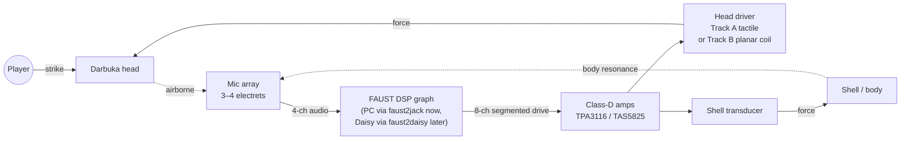
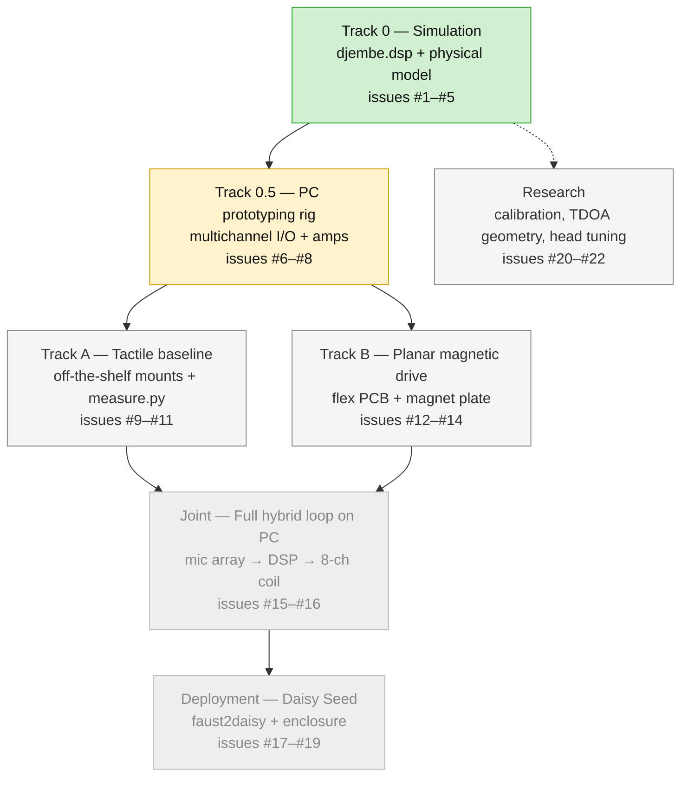

# digital-djembe

A hybrid acoustic-electric hand drum. The instrument is a **darbuka**
with its natural acoustic sound augmented by DSP-driven feedback, modal
resonance, segmented head actuation, and nonlinear processing. The goal
is *controllable musical chaos* — an electroacoustic instrument whose
feedback is rich and playable rather than a locked-pitch Larsen drone.

**Status (2026-04):** a FAUST simulation with a circular-membrane
physical model runs on Linux today. Hardware work (tactile baseline
and planar-magnetic flex PCB) is in parallel. The PC + multichannel
USB audio interface is the primary prototyping platform; Daisy Seed
is the deployment target, not the first target. [PLAN.md](PLAN.md) is
the authoritative design document; live work is tracked in
[22 GitHub issues](https://github.com/dnewcome/digital-djembe/issues)
across 7 labels (`sim`, `pc-rig`, `track-a`, `track-b`, `integration`,
`deploy`, `research`).

## Signal flow



## Design thesis

Two prior attempts shape this design:

- **Speaker inside the body under the head** produced a single-pitch
  squeal. Structural failure: pure acoustic feedback through one
  transducer converges to whichever mode has highest loop gain and
  locks there.
- **Piezo discs bonded to the head** drove the head successfully but
  with a peaky, bass-weak frequency response (intrinsic 3–8 kHz piezo
  resonance, vanishing displacement at low frequency, capacitive-load
  mismatch). Validated direct head-drive as a concept; ruled out
  piezos as the actuator class.

Avoiding a locked-pitch Larsen drone requires two things, and the
whole DSP design is built around them:

1. **Phase incoherence in the loop** — a small (3–20 Hz) single-sideband
   frequency shift in the feedback path prevents any mode from
   phase-matching round-trip, so feedback drifts chaotically in pitch
   instead of locking.
2. **Multiple parallel DSP paths** — a modal resonator bank, a bank of
   self-oscillating state-variable filters, and a nonlinear waveshaper
   run in parallel with the direct feedback path, so no single mode
   dominates the system's behavior.

Sensing is a **3–4 element mic array** inside the body, doing triple
duty: audio pickup, onset/velocity detection, and hit localization via
time-difference-of-arrival. Control is **MIDI over USB**. See
[PLAN.md](PLAN.md) for the full architecture, decision log, and open
questions.

## Simulation (runs today)

`djembe.dsp` is a FAUST simulation of the closed acoustic-electric
loop. A virtual strike at position (X, Y) on the head excites each
circular-membrane mode (m, n) in proportion to the mode shape at the
strike point — `J_m(j_{m,n} · r) · cos(m·φ)` — where the nine modes
used are the first nine Bessel-zero eigenmodes of an ideal clamped
membrane. The excited modes ring through a resonant biquad bank,
which is then fed through the four parallel DSP paths (freq-shifted
feedback, modal resonator bank, self-oscillating SVFs, waveshaper)
and summed.

```sh
# Toolchain sanity check (stereo sine)
faust2jack sine.dsp && pw-jack ./sine

# Full simulation
faust2jack djembe.dsp && pw-jack ./djembe
```

Try: strike with defaults (X=0, Y=0) for a centered thump, then move
**Strike X** to ~0.7 and strike again — the off-axis strike lights up
the m≥1 modes and the timbre shifts toward tom-like inharmonic content.
Bessel evaluation uses libm's `j0f`/`j1f`/`jnf` via FAUST `ffunction`,
so the same `.dsp` file compiles for PC (`faust2jack`) and Daisy
(`faust2daisy`) without changes. See
[PLAN.md §3.4](PLAN.md#34-physical-model-as-a-first-class-component)
for the PDE derivation, mode table, known omissions (air load,
sin-partner pairs, per-mode Q, pickup-location readout weight), and
calibration plan.

## Two transducer tracks

**Track A — tactile (baseline).** Off-the-shelf tactile transducers
clamped to the darbuka's metal hoop or magnet-mounted to the body.
Cheap, available now, and the reference against which Track B is
compared. This is what `measure.py` and `brackets.scad` currently
support. See [PLAN.md §5](PLAN.md#5-transducer-track-a-tactile--off-the-shelf-baseline).

**Track B — planar magnetic flex-PCB coil on the head.** A thin
multi-layer flex PCB spiral coil is laquered to the outer annulus of
the drum head, with an alternating-polarity magnet array mounted
inside the shell directly below. The head becomes the diaphragm of a
planar magnetic driver — same principle as a HiFiMan/Audeze headphone,
applied to a darbuka. Low added mass (~1–2 g) means minimal damping
of the acoustic character. Because force is F = BIL (proportional to
current), response is flat across the audio band — the piezo FR
problem doesn't apply.

The coil is **segmented** along three orthogonal axes (see
[§6.3](PLAN.md#63-coil-segmentation--modal-selectivity)):

- **Azimuthal** — N wedges around the ring, reaches azimuthal modes
  m=0..m=(N/2).
- **Radial** — two concentric coil rings at different radii lets in-/
  anti-phase driving pick between radial modes (n=1 fundamental vs.
  n=2 overtone).
- **Drive pattern** — the phase/amplitude per segment in real time
  selects rotating, dipole, quadrupole, or hit-location-following
  excitation.

First-prototype target: **2 concentric rings × 4 azimuthal wedges =
8 coils**, driven by two 4-channel class-D boards, reaching m=0..m=2
× n=1..n=2. Power budget (see
[§6.4](PLAN.md#64-power-efficiency-and-thermal-budget)) comes out to
~0.5 W per coil, ~4 W across the array — about 2 orders of magnitude
below the PCB's thermal ceiling, so the coil comfortably sustains
feedback; it's just not a speaker.

## Tracks and current progress



**Where we are:**

- **Track 0 (simulation):** `djembe.dsp` works. Circular-membrane
  physical model wired in; strike position (X, Y) audibly changes
  timbre. Next refinements: mic readout weights (fixes a rotational-
  symmetry asymmetry audible at X=±0.7), true SSB freq-shifter, sin-
  partner modes, per-mode Q.
- **Track 0.5 (PC rig):** single-channel simulation runs; extending
  `djembe.dsp` to 4-in / 8-out multichannel and documenting the rig
  + amp chain is the next batch.
- **Track A (tactile):** `brackets.scad` and `measure.py` are ready;
  BOM not yet purchased. The measurement gate (do any mounts couple
  broadband into the head?) is still open.
- **Track B (planar magnetic):** design spec complete; no PCB yet.
- **Joint / Deployment / Research:** sequenced behind the above.

Live state: [Issues](https://github.com/dnewcome/digital-djembe/issues).

## Platform: prototype on PC, deploy to Daisy

Two targets, **same FAUST DSP graph**. `faust2jack` compiles
`djembe.dsp` for PC + a multichannel USB audio interface; `faust2daisy`
compiles the same source for bare-metal Daisy Seed.

- **PC + 8-in/8-out interface** is the primary prototyping platform.
  Channel count matches Track B's first PCB exactly (4-ch mic array +
  8-ch segmented coil drive). Iteration is seconds (edit → `faust2jack`
  → restart client → test), not minutes. External class-D amps — the
  same ones planned for the final build — drop in between interface
  outputs and transducers today, so the analog chain is validated
  end-to-end before any Daisy firmware is written.
- **Daisy Seed** (STM32H7, 480 MHz, onboard codec) is the deployment
  target: small, cheap, standalone. Daisy's onboard codec is stereo
  only, so the deployed instrument also needs an external TDM ADC
  (AK5558 / PCM1865) + 8-ch I2S DAC — avoidable during prototyping
  because the PC interface covers it natively.

Latency: JACK / PipeWire at 48 kHz, 64-sample buffer → ~3–6 ms
round-trip on PC, vs. ~1 ms on Daisy. Enough difference that the
feedback loop will prefer different modes on the two platforms, not
enough to kill the effect. See
[PLAN.md §2](PLAN.md#2-compute-platforms--prototype-on-pc-deploy-to-daisy).

## Why a darbuka

The project started as a "digital djembe." It pivoted to a darbuka
because a darbuka's tensioning hoop is a **removable metal ring**,
whereas a djembe's head is held by rope. The metal hoop is rigid, in
intimate contact with the skin at its boundary, and bolt-able without
modifying the instrument — which turns the "how do we drive the head"
problem from a research question into a mechanical one.

## Repository contents

| File | Purpose |
|------|---------|
| [`PLAN.md`](PLAN.md) | Living design document. Architecture, DSP graph, physical model, decision log, next steps. **Authoritative.** |
| [`djembe.dsp`](djembe.dsp) | FAUST simulation: strike → physical model → 9-mode head bank → four parallel DSP paths → output. Runs on PC via `faust2jack`. |
| [`sine.dsp`](sine.dsp) | Toolchain sanity check: stereo sine with frequency + gain sliders. |
| [`measure.py`](measure.py) | Farina log sine sweep → impulse response → transfer function, for comparing transducer mounts. |
| [`brackets.scad`](brackets.scad) | Parametric OpenSCAD: hoop clamp, bolt-capture bracket, magnetic body plate, measurement mic jig. |

## Measurement workflow

The transducer-mount coupling experiment is the Track A gate. Mount
a transducer three ways, sweep each, compare transfer functions.

```sh
# 1. Fill in your darbuka's dimensions at the top of brackets.scad,
#    then export STLs for the parts you want to print:
#      part = "mic_jig"       // always print this
#      part = "hoop_clamp"    // non-destructive hoop mount (start here)
#      part = "bolt_bracket"  // replaces a tuning-bolt washer
#      part = "body_magnet"   // baseline for metal-body darbukas

# 2. Install measurement deps:
pip install numpy scipy sounddevice matplotlib

# 3. Identify your audio interface:
python measure.py --list-devices

# 4. Record each mount (drum still, room quiet). Use the mic_jig so the
#    reference mic sits at a fixed position between runs.
python measure.py --label hoop-clamp      --in-device 2 --out-device 3
python measure.py --label bolt-bracket    --in-device 2 --out-device 3
python measure.py --label body-magnet     --in-device 2 --out-device 3

# 5. Compare:
python measure.py --compare hoop-clamp bolt-bracket body-magnet
```

Output lands in `measurements/` (ignored by git): per-run `.npz` with
the smoothed transfer function and IR, the raw recording, and a
side-by-side comparison PNG.

## Hardware (prototype phase)

**Track A — tactile measurement baseline:**
- Dayton DAEX25FHE-4 tactile transducer (body driver)
- Dayton DAEX13CT-4 tactile transducer (hoop driver)
- TPA3116 class-D amp board
- USB measurement mic (Dayton UMM-6 or similar)
- N52 neodymium discs (10 × 3 mm) for the body-magnet mount
- M3 bolts + nuts for clamp pinch
- PETG filament for the printed parts

**Track B — planar magnetic drive:**
- 4-layer flex PCB, 2 oz copper, ~200 mm OD annular (JLCPCB/PCBWay,
  ~$10/board at MOQ 5)
- N42 bar magnets (3 × 3 × 20 mm), 16+ per drum, alternating polarity
- Two 4-channel class-D amp boards (8 channels total)
- 3M 467MP adhesive or urethane laquer for bonding the coil to the head

**PC prototyping rig (primary dev platform):**
- Any Linux box with JACK or PipeWire-JACK
- 8-in / 8-out USB audio interface (already on hand)
- FAUST toolchain (`faust2jack`), pipewire-jack (`pw-jack`)

**Deployment (after PC prototype validates):**
- Daisy Seed (STM32H7 + codec)
- External multichannel TDM ADC — AK5558 or pair of PCM1865s — for
  the mic array (Daisy's onboard codec is stereo only)
- 8-ch I2S DAC to drive the amps
- 3–4 WM-61A-class electrets + simple preamps
- Small UI panel (pots, encoder, OLED)

## License

No license chosen yet. Treat as all rights reserved until a `LICENSE`
file appears.
